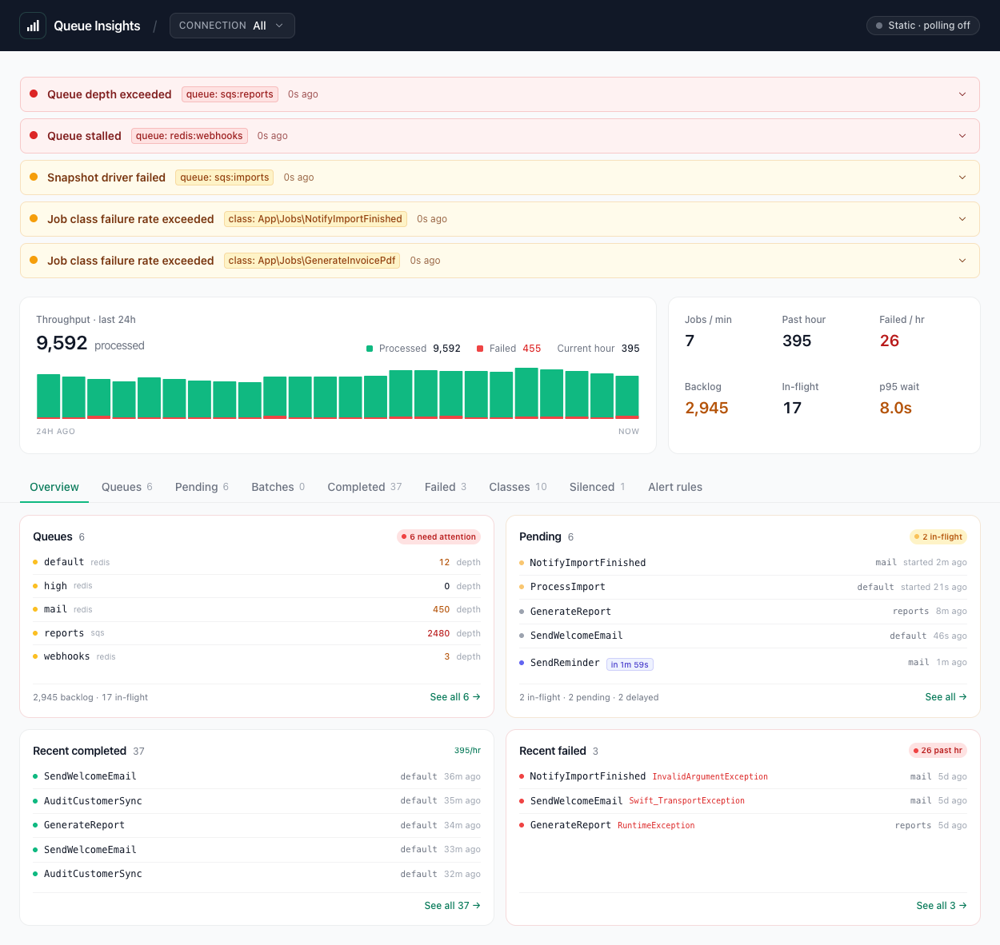

[](https://sandermuller.github.io/laravel-queue-insights/)

# Laravel Queue Insights

[](https://packagist.org/packages/sandermuller/laravel-queue-insights)
[](https://github.com/sandermuller/laravel-queue-insights/actions?query=workflow%3Arun-tests+branch%3Amain)
[](https://github.com/sandermuller/laravel-queue-insights/actions?query=workflow%3Aphpstan+branch%3Amain)
[](https://packagist.org/packages/sandermuller/laravel-queue-insights)
[](LICENSE)
[](https://packagist.org/packages/sandermuller/laravel-queue-insights)

Self-hosted queue observability for Laravel that doesn't care which driver you run. Queue depth,
in-flight and delayed counts, enqueue-to-pickup wait time, per-class metrics, batches, chains,
failures with their captured context, alerting, Prometheus metrics, and scheduler runs, all of it
the same on SQS, Redis, database, and Laravel Cloud managed queues. No Horizon required, and no
job data sent anywhere.

Everything goes into a bounded Redis keyspace that evicts itself. The dashboard is Livewire and
Blade with no Filament or Nova coupling, so you can mount it in the admin layout you already have.

**[Live demo: queue-insights-demo.laravel.cloud](https://queue-insights-demo.laravel.cloud)** —
public preview on Laravel Cloud, seeded with realistic fixtures.

## Installation

```bash
composer require sandermuller/laravel-queue-insights
php artisan vendor:publish --tag=queue-insights-config
```

Requires PHP 8.3+, Laravel 11/12/13, Redis, and `livewire/livewire` 3 or 4 if you use the bundled
dashboard route. The service provider auto-discovers. See
[Installation](https://sandermuller.github.io/laravel-queue-insights/installation) for the full
requirements and the environment knobs, and
[UPGRADING.md](UPGRADING.md) when upgrading from an older release.

## Usage

Every tile, alert detector, and Prometheus gauge reads from snapshots written by
`queue-insights:snapshot`. The package registers it on Laravel's scheduler with
`->everyMinute()->withoutOverlapping()`, so a host running `php artisan schedule:work` (or the
equivalent cron) is all it needs.

The dashboard mounts at `/queue-insights` when `dashboard.enabled=true`. Authorise it with a Gate:

```php
// app/Providers/AuthServiceProvider.php
Gate::define('viewQueueInsights', fn ($user) => $user->isAdmin());
```

Payload capture is off by default, and there are good reasons to leave it that way. Read
[Payload capture](https://sandermuller.github.io/laravel-queue-insights/payload-capture) and
[SECURITY.md](SECURITY.md) before turning it on.

## Documentation

Read the full documentation at **[sandermuller.github.io/laravel-queue-insights](https://sandermuller.github.io/laravel-queue-insights/)**. The source lives in [docs/](docs/README.md).

**Getting started**
- [Why Queue Insights?](https://sandermuller.github.io/laravel-queue-insights/why-queue-insights) — what it answers that `queue:work` and a `failed_jobs` table do not, and the full feature list
- [Installation](https://sandermuller.github.io/laravel-queue-insights/installation) — requirements, the snapshot scheduler, environment knobs
- [Payload capture](https://sandermuller.github.io/laravel-queue-insights/payload-capture) — the three modes, the separate pending budget, custom sanitizers

**Dashboard**
- [Dashboard](https://sandermuller.github.io/laravel-queue-insights/dashboard) — authorisation, multi-connection scoping, retry permissions and workflow, filtering
- [Jobs, batches, and chains](https://sandermuller.github.io/laravel-queue-insights/jobs-batches-chains) — wait time, the pending inspector, batch progress, chain lineage, job initiator
- [Failure context](https://sandermuller.github.io/laravel-queue-insights/failure-context) — what is captured on failure, and the Sentry deep-link
- [Theming and embedding](https://sandermuller.github.io/laravel-queue-insights/theming-and-embedding) — custom row markup, admin-layout embedding, dark mode, the cloud look

**Operations**
- [Running workers](https://sandermuller.github.io/laravel-queue-insights/running-workers) — the `queue-insights:work` supervisor, its non-goals, shutdown grace tuning
- [Ops runbook](https://sandermuller.github.io/laravel-queue-insights/ops-runbook) — console commands, dashboard signals, driver quirks, key prefixes, Redis Cluster
- [Alerting](https://sandermuller.github.io/laravel-queue-insights/alerting) — nine detectors, cooldown, log / Slack / mail / Sentry channels, typed events, silencing

**Integrations**
- [Horizon auto-discovery](https://sandermuller.github.io/laravel-queue-insights/horizon) — supervisor queues and silenced jobs read from your Horizon config
- [Connection aliasing](https://sandermuller.github.io/laravel-queue-insights/connection-aliasing) — collapsing dispatcher/worker connection drift onto a canonical key
- [Prometheus](https://sandermuller.github.io/laravel-queue-insights/prometheus) — the `/metrics` endpoint, the metric catalogue, scheduler families, the push gateway
- [Scheduler observability](https://sandermuller.github.io/laravel-queue-insights/scheduler) — task snapshots, run records, missed and hung detection, retention
- [Vapor and Laravel Cloud](https://sandermuller.github.io/laravel-queue-insights/vapor-and-cloud) — what the managed platforms handle for you, and the few queues you list yourself

**Reference**
- [Configuration reference](https://sandermuller.github.io/laravel-queue-insights/configuration) — every key in `config/queue-insights.php`, with defaults and what each one changes

## Upgrading

See [UPGRADING.md](UPGRADING.md) for migration steps between minor versions. Patch releases never require manual steps.

## Changelog

See [CHANGELOG.md](CHANGELOG.md) and the [GitHub releases page](https://github.com/SanderMuller/laravel-queue-insights/releases). The changelog is updated automatically on release publish — do not edit by hand.

## Contributing

See [CONTRIBUTING.md](CONTRIBUTING.md) for local setup, the check commands, and how the Redis Cluster tests are run.

## Security Vulnerabilities

Please review [our security policy](SECURITY.md) on how to report security vulnerabilities.

## Credits

- [Sander Muller](https://github.com/SanderMuller)
- [All Contributors](https://github.com/SanderMuller/laravel-queue-insights/contributors)

## License

MIT. See [`LICENSE`](LICENSE).
